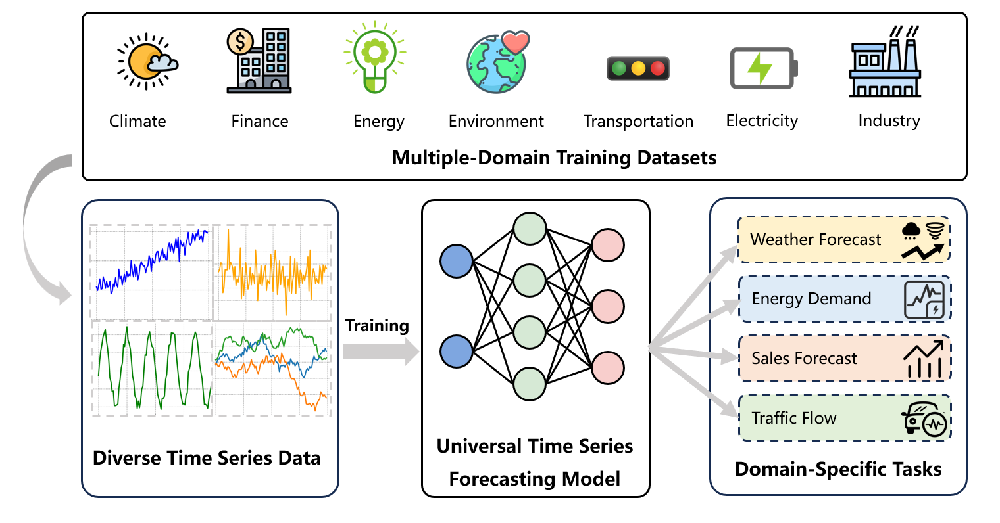
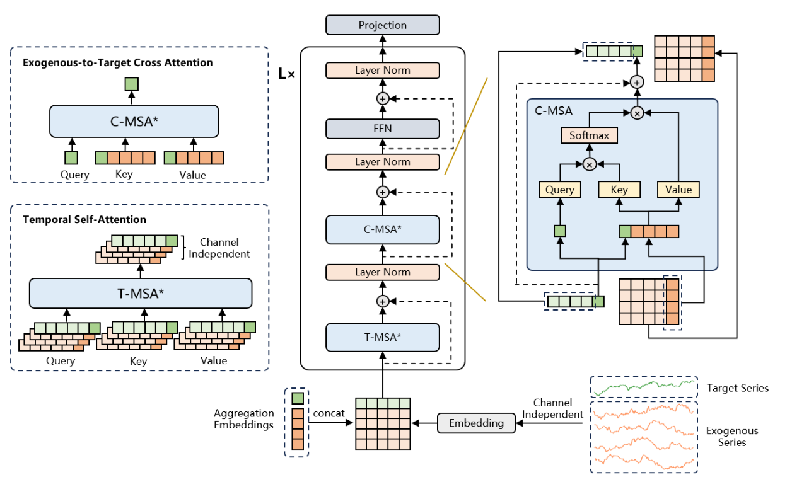
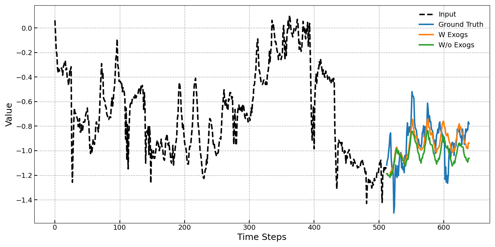
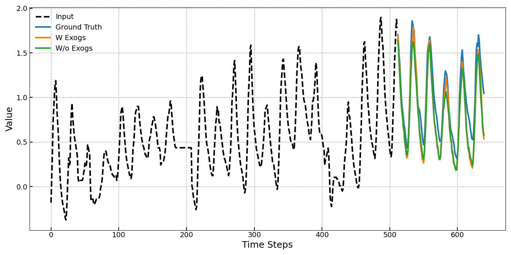
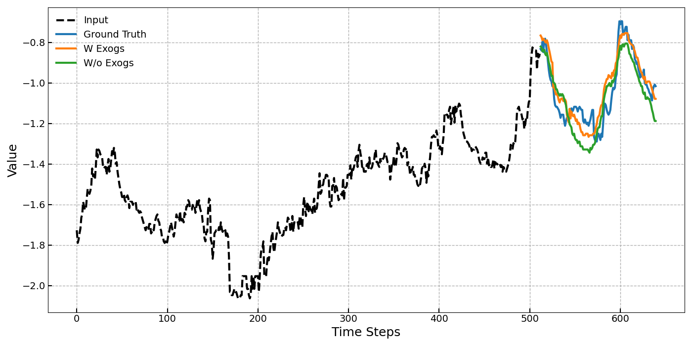
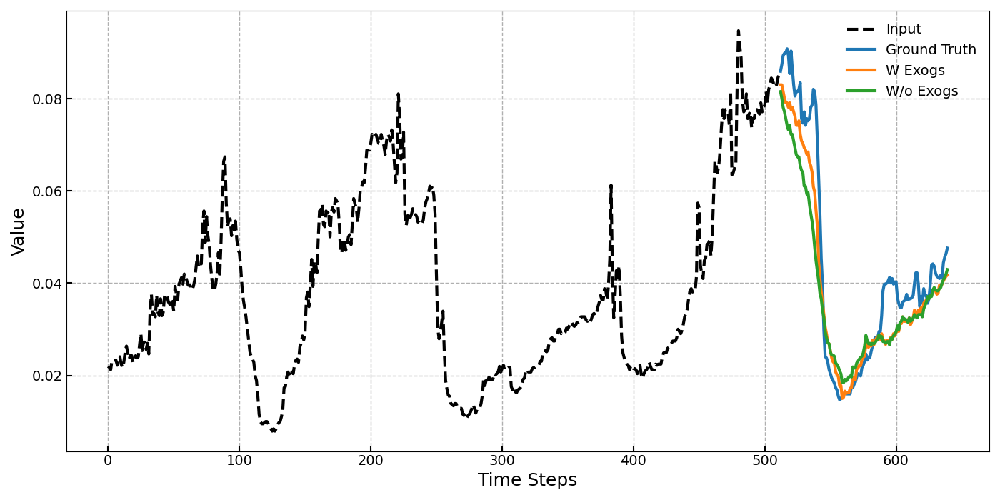
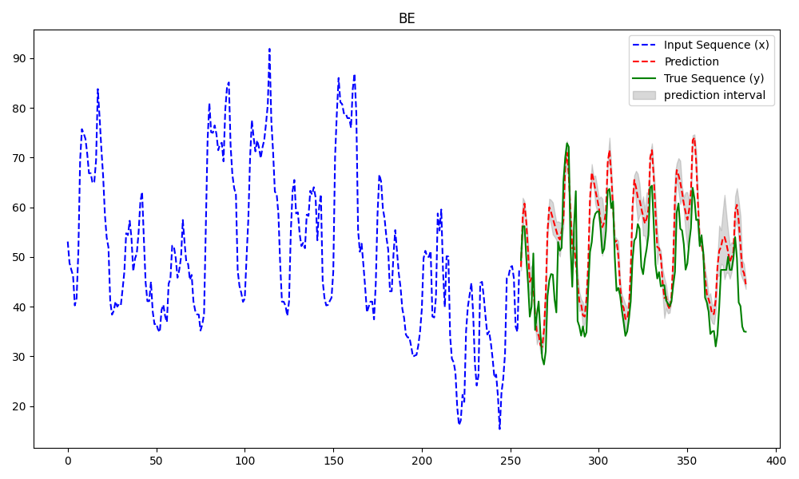

# UniCastX: A Universal Foundation Model for Zero-Shot Time Series Forecasting with Exogenous Variables

\[ English | [中文](README_zh.md) \]

## ✨ Introduction



UniCastX is a Transformer-based universal foundation model designed for zero-shot time series forecasting tasks, effectively leveraging exogenous variables to enhance predictive performance. Unlike traditional deep learning methods, UniCastX addresses the challenge of cross-domain generalization by effectively modeling complex temporal dependencies and external influences without the need for dataset-specific fine-tuning. Trained on an extensive and diverse dataset comprising 26 billion time points from various domains such as energy, climate, web analytics, transportation, and finance, UniCastX demonstrates superior zero-shot forecasting performance compared to existing foundation models. It also provides competitive performance when compared to supervised learning approaches for in-distribution forecasting tasks. Additionally, UniCastX offers robustness against noise in exogenous variables and efficient inference, making it highly practical for real-world forecasting applications.

## 🧩 Architecture

UniCastX adopts a Transformer-based encoder-only architecture tailored specifically for time series forecasting with exogenous variables. The architecture incorporates the following key components:

- **Input Embedding**: Input time series data are processed using a robust normalization strategy to handle diverse scales and potential outliers. The normalized data are segmented into patches and transformed into embeddings through a shared linear embedding layer, creating independent embeddings for target and exogenous series.

- **Aggregation Embedding**: Learnable aggregation tokens are appended to the target and exogenous embeddings to aggregate and summarize temporal information globally. This facilitates effective cross-attention, ensuring exogenous variables are appropriately integrated into target predictions.

- **Encoder Layers**: Each encoder layer consists of two primary attention mechanisms:
  - **Temporal Self-Attention**: Captures channel-independent temporal dependencies within the target and exogenous series, ensuring clear separation and accurate modeling of each series' inherent temporal structure.
  - **Exogenous-to-Target Cross-Attention**: Models the directional influence of exogenous variables on the target variable, allowing UniCastX to dynamically adapt to external factors and minimize the influence of irrelevant or noisy exogenous series.

- **Aggregation Tokens**: Learnable aggregation embeddings are employed to consolidate temporal and cross-attention outputs, generating a global representation of both target and exogenous series.

- **Forecasting Head**: The global representation from the final encoder layer is projected through a linear layer to generate predictions for future time steps, enabling effective multi-step forecasting.



This innovative design ensures efficient processing, robust predictions, and flexibility across a wide variety of forecasting scenarios, from zero-shot to supervised fine-tuning, highlighting UniCastX's versatility as a universal foundation model for time series forecasting.

## 💡 Experimental Results
The following figure showcases the remarkable prediction performance of UniCastX with and without exogenous variables.

<table align="center">
    <tr>
        <td></td>
        <td></td>
    </tr>
    <tr>
        <td></td>
        <td></td>
    </tr>
</table>

Visualization cases of UniCastX’s performance with (and without) exogenous series across (a) ETTh1, (b) ETTh2, (c) ETTm1, and (d) Weather.

## ⚙️ Installation

1. Clone repository:
```shell
git clone https://github.com/suan-chang/rain-UniCastX.git
```

2. Install dependencies (with python 3.10) 

```shell
pip install -r requirements.txt
```

## 🏃 Getting Started
A simple example of using the UniCastX model.

```python
import pandas as pd

from src.model.model import RainTimeSeriesModel
from src.utils.args import InferArguments

target_col = "y"
time_col = "ds"
exog_cols = []
level = 0.9
freq = "H"
horizon = 128

file_path = "data/electricity.csv"
df = pd.read_csv(file_path)

unique_id = "BE" # BE DE FR NP

be = df[df["unique_id"] == unique_id]
be_ground_truth = be.iloc[-horizon:]
be = be.iloc[:-horizon]

model_args = InferArguments()
model = RainTimeSeriesModel(model_args)

prediction, boundaries = model.predict(
    data=be,
    time_col=time_col,
    target_col=target_col,
    exog_cols=exog_cols,
    freq=freq,
    horizon=horizon,
    level=level,
)

plot(
    data=be,
    ground_truth=be_ground_truth,
    target_col=target_col,
    prediction=prediction,
    boundaries=boundaries
)
```


See the [notebook example](quickstart.ipynb) for UniCastX on common tasks, e.g. visualizing forecasts, predicting from pandas DataFrame, etc.

## 📑 Paper
Coming soon.
