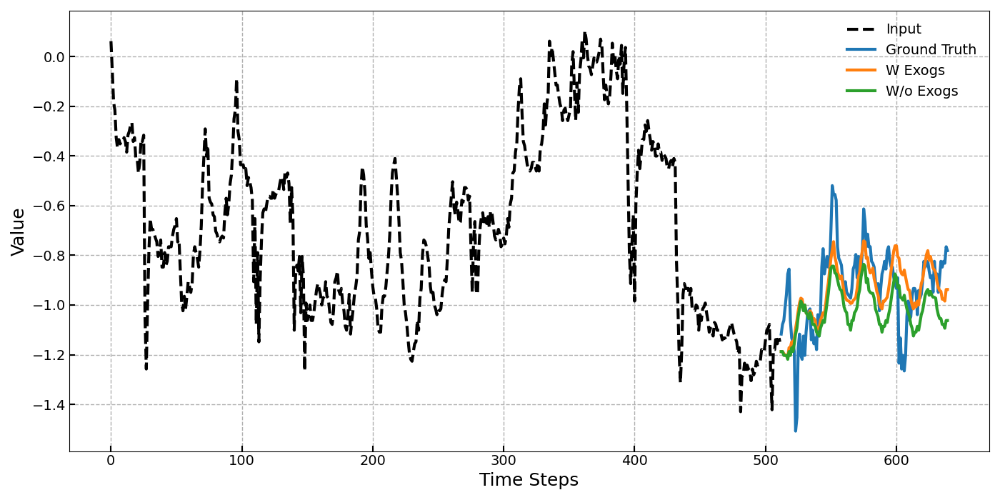
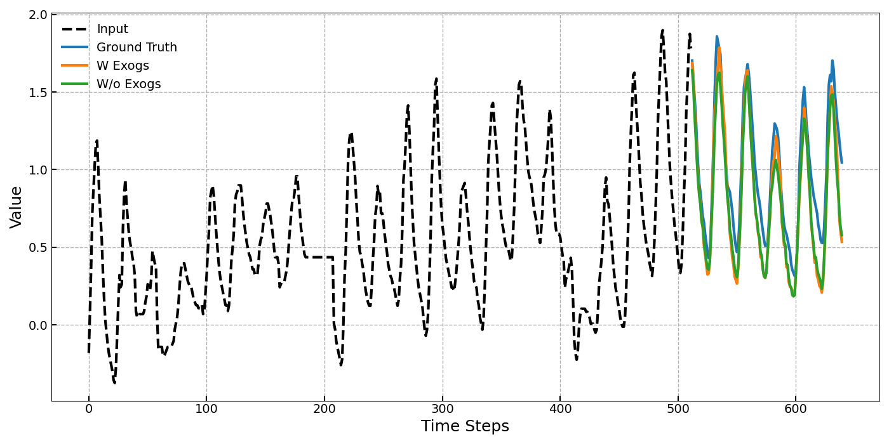
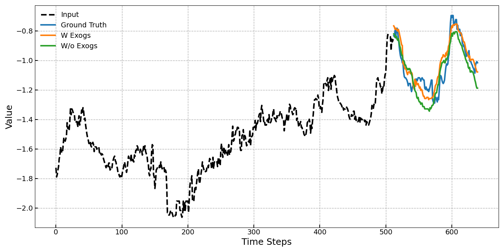

# UniCastX: A Universal Foundation Model for Zero-Shot Time Series Forecasting with Exogenous Variables

\[ [English](README.md) | 中文 \]

## ✨ 简介


UniCastX是一个基于Transformer的通用基础模型，专为零样本时间序列预测任务而设计，能够有效利用外生变量来提升预测性能。与传统的深度学习方法不同，UniCastX通过有效建模复杂的时间依赖关系和外部影响，克服了跨领域泛化的挑战，而无需针对特定数据集进行微调。该模型在广泛且多样化的数据集上训练，其中涵盖能源、气候、网络、交通和金融等多个领域，包含260亿个时间点。与现有的基础模型相比，UniCastX在零样本预测任务中表现更优，同时，在分布内预测任务中，其性能也能与监督学习方法相媲美。此外，UniCastX 对外生变量中的噪声具有较强的鲁棒性，并具备高效的推理能力，使其在实际的预测应用中极具实用价值。

## 🧩 架构

UniCastX采用基于Transformer的encoder-only架构，专为带外生变量的时间序列预测任务优化。该架构包含以下核心组件：

- **输入编码**: 输入的时间序列数据经过鲁棒的归一化策略处理，以适应不同尺度并应对潜在异常值。归一化后的数据被分割为patch，并通过共享的线性嵌入层转换为嵌入向量，为目标序列和外生变量序列生成独立的嵌入表示。

- **聚合编码**: 在目标序列和外生变量的嵌入向量后添加可学习的聚合token，用于全局聚合和总结时间信息。这种机制能够增强跨注意力（cross-attention）机制，确保外生变量被有效整合到目标变量的预测中。

- **编码层**: 每个编码器层包含两种主要的注意力机制：
  - **时间自注意力**: 以通道独立（channel-independent）的方式捕捉目标序列和外生变量的时间依赖关系，确保不同时间序列的结构清晰分离，并能准确建模其固有的时间特征。
  - **外生变量与目标变量的跨注意力**: 外生变量到目标变量的跨注意力建模外生变量对目标变量的方向性影响，使UniCastX能够动态适应外部因素，同时抑制无关或噪声外生变量的影响。

- **聚合Tokens**: 采用可学习的聚合嵌入向量进一步整合时间注意力和跨注意力机制的输出，生成目标变量和外生变量的全局表示。

- **预测头**: 最终编码器层的全局表示经过线性投影层，用于生成未来时间步的预测结果，从而实现高效的多步预测。


这一创新性设计确保了高效的数据处理、稳健的预测能力，并具备广泛的适应性，能够灵活应对从零样本预测到监督微调等多种预测场景，充分展现了UniCastX作为通用时间序列预测基础模型的多功能性。

## 💡 实验结果
下图展示了UniCastX在有无外生变量情况下的预测结果。

<table align="center">
    <tr>
        <td></td>
        <td></td>
    </tr>
    <tr>
        <td></td>
        <td></td>
    </tr>
</table>

UniCastX在以下数据集上有/无外生变量时的性能可视化案例：(a) ETTh1，(b) ETTh2，(c) ETTm1，(d) Weather

## ⚙️ 安装

1. 克隆仓库:
```shell
git clone https://github.com/suan-chang/rain-UniCastX.git
```

2. 安装依赖 (使用 python 3.10) 

```shell
pip install -r requirements.txt
```

## 🏃 如何使用
使用UniCastX模型的简单示例

```python
import pandas as pd

from src.model.model import RainTimeSeriesModel
from src.utils.args import InferArguments

target_col = "y"
time_col = "ds"
exog_cols = []
level = 0.9
freq = "H"
horizon = 128

file_path = "data/electricity.csv"
df = pd.read_csv(file_path)

unique_id = "BE" # BE DE FR NP

be = df[df["unique_id"] == unique_id]
be_ground_truth = be.iloc[-horizon:]
be = be.iloc[:-horizon]

model_args = InferArguments()
model = RainTimeSeriesModel(model_args)

prediction, boundaries = model.predict(
    data=be,
    time_col=time_col,
    target_col=target_col,
    exog_cols=exog_cols,
    freq=freq,
    horizon=horizon,
    level=level,
)

plot(
    data=be,
    ground_truth=be_ground_truth,
    target_col=target_col,
    prediction=prediction,
    boundaries=boundaries
)
```


请参考[notebook example](quickstart.ipynb) 示例，查看UniCastX在常见任务中的应用，例如可视化预测结果、基于pandas DataFrame进行预测等。

## 📑 Paper
即将推出
